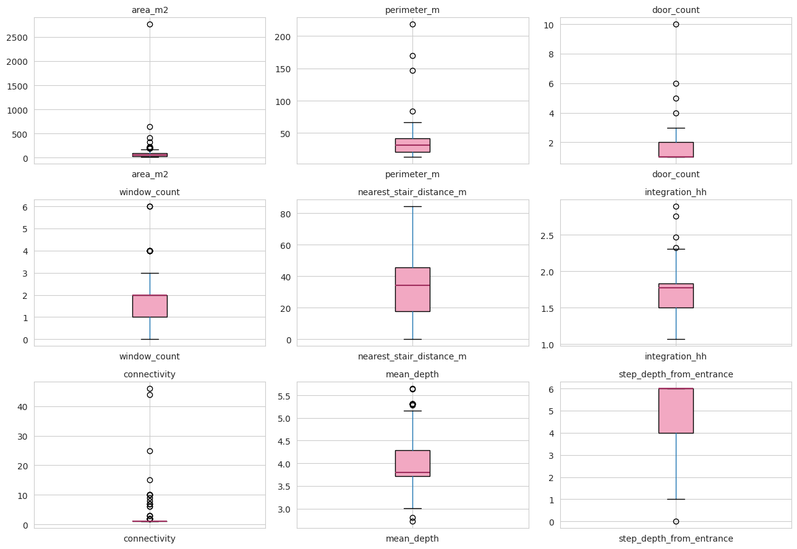
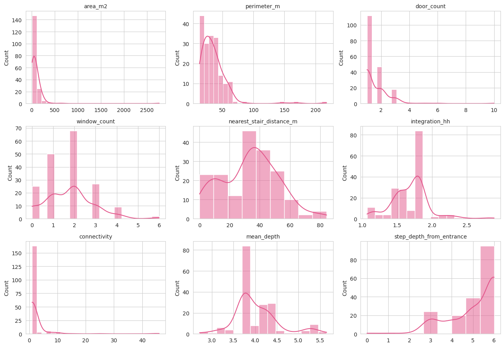
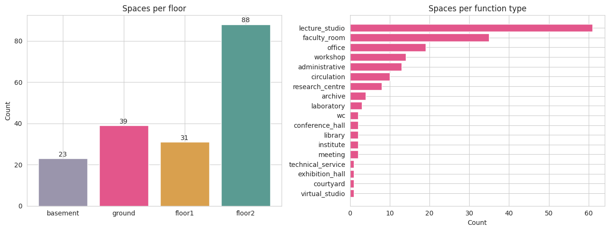

# MBL549E — Final Project
## Taşkışla: Historical Plan vs. Contemporary Function — A Walkability Inquiry

**Şeyma Olcay** · ITU Architectural Design Computing Master's
MBL549E — Special Topics in Architectural Design

---

## Project Overview

This project examines whether Taşkışla's 1850 plan — designed as military barracks by William James Smith and converted into the ITU Faculty of Architecture in 1943 — aligns with the walkability needs of today's architectural education.

The building (132 × 95 m, 4 floors, a 70 × 40 m central courtyard) was not designed together with its current academic program. A nineteenth-century military logic now houses twenty-first-century design education. The project measures the topological accessibility of each space from the main entrance and asks where today's academic priorities align with — and where they conflict with — the historical plan.

### Research Question

> **Does Taşkışla's 1850 plan, designed as military barracks, align with the walkability needs of today's architectural education?**

### Narrative

The historical plan absorbs public and educational uses on the ground floor — but pushes production-heavy programs (workshops, laboratories, archives) into deep, isolated positions that the 1850 barracks logic still imposes on the building.

### Intended Audience

- Architects and spatial designers
- Space syntax researchers
- Adaptive reuse specialists
- Heritage building consultants
- Architectural educators

---

## Dataset

| | |
|---|---|
| **Total records** | 181 spaces |
| **Total columns** | 18 |
| **Floors** | 4 (basement, ground, 1st, 2nd) |
| **Function types** | 18 distinct categories |
| **Graph structure** | 181 nodes, 200 edges, 1 connected component |
| **Entrance node** | room #137 (main entrance) |
| **Data collection** | May–June 2026 |
| **Source** | Manual tracing of ITU Faculty of Architecture official floor plans |

### Files in this Submission

```
taskisla_final/
├── dataset.pkl                       # Final dataset (pandas pickle)
├── dataset.xlsx                      # Excel mirror
├── dataset.csv                       # CSV mirror
├── dataDictionary.json               # Column-by-column field definitions
├── metadata.json                     # Project metadata
├── requirements.txt                  # Python libraries used
├── README.md                         # This file
├── spatial_graph.json                # NetworkX graph as JSON (nodes + edges)
├── taskisla.dxf                      # Source DXF exported from Rhino
├── infographics/
│   ├── poster_01_building.svg        # Floating-balloons axonometric (alignment)
│   ├── poster_02_outliers.svg        # Outlier constellation (distribution)
│   ├── poster_03_rings.svg           # Reachability rings (topology)
│   └── taskisla_presentation.html    # The three posters as one scrolling page
├── notebook/
│   └── Taskisla_DataAudit.ipynb      # Six-step audit (executable Jupyter)
├── scripts/
│   ├── build_graph.py                # Reads DXF, reconstructs polygons, matches rooms
│   ├── compute_syntax.py             # Builds NetworkX graph, computes syntax metrics
│   └── fill_missing.py               # Computes perimeter & nearest-stair distance
├── images/                           # Audit plots (PNG)
│   ├── distributions.png             # Distribution histograms (6 variables)
│   ├── outliers.png                  # Outlier box-plots
│   └── spaces.png                    # Spaces by floor & function
├── brochure/                         # Print-ready poster PDFs
│   ├── 1.pdf                         # Poster 01
│   ├── 2.pdf                         # Poster 02
│   └── 3.pdf                         # Poster 03
└── case_studies/                     # Semester deliverables (CS1–CS4)
    ├── CS1_Data_Literacy/            # Beşiktaş Square data literacy
    ├── CS2_Web_Scraping/             # Italian Architects Wikipedia dataset
    ├── CS3_Data_Audit/               # Six-step audit on Wikipedia dataset
    └── CS4_Information_Visualization/ # Three data visualizations (HTML)
---

## Methodology

The pipeline follows five stages from raw plan to final infographic.

### Stage 01 — Manual Data Collection
181 spaces were extracted from the official ITU Faculty of Architecture floor plans (https://mim.itu.edu.tr/kat-planlari/). For each space, the following attributes were recorded by hand: `room_id`, `floor`, `function_type`, `function_detail`, `door_count`, `window_count`, `facade_orientation`, `opens_to`, `nearest_stair_id`.

### Stage 02 — Rhino + Grasshopper
All spaces were traced as polylines in Rhinoceros 8 (scaled to the known 132 m long facade). A Grasshopper definition reads each polyline and extracts `area_m2`, `centroid_x`, `centroid_y`. Door connections and stair landings were drawn on dedicated layers (`02_DOORS`, room polylines on per-floor layers under `01_ROOMS`).

### Stage 03 — Python + NetworkX (Space Syntax)
DXF was exported from Rhino and read in Python via `ezdxf`. Room polygons were reconstructed from line segments using `shapely.ops.polygonize`. A graph was built in NetworkX with rooms as nodes and doorways as edges, supplemented by inter-floor stair connections at the four corner cores. The following space syntax metrics were computed:

- **`connectivity`** — node degree
- **`mean_depth`** — average shortest-path distance to all other rooms
- **`integration_hh`** — Hillier's normalized closeness centrality, `1 / RRA`
- **`step_depth_from_entrance`** — BFS distance from the main entrance (room #137)

A graph-based (axial) approach was chosen over DepthmapX's VGA grid because it maps directly onto the manually recorded `opens_to` data and produces interpretable, room-level metrics consistent with the structure of the dataset.

### Stage 04 — Walkability Scoring
A composite alignment score was defined as the **inverse step-depth weighted by functional priority**:

```
walkability_norm = 1 − (step_depth_from_entrance / max_step_depth)
alignment        = walkability_norm × (function_priority / 5)
```

Function priorities (1–5):
- **5 (critical)**: lecture_studio, exhibition_hall, conference_hall, library
- **4 (high)**: workshop, laboratory, meeting, virtual_studio
- **3 (medium)**: faculty_room, office, research_centre, institute, administrative
- **2 (low)**: circulation, courtyard
- **1 (peripheral)**: archive, wc, technical_service

### Stage 05 — Audit & Infographics

A six-step data audit (see notebook) verified data quality. Three infographics were produced in SVG on a shared cream base: a floating-balloons axonometric showing the alignment story, an outlier constellation revealing the building's signature spaces, and a reachability-rings diagram in which one top-down figure stands for each room — placed by its step-depth from the entrance and coloured by programme — showing how the building branches outward from a single door. Posters 01 and 02 keep the cream-and-pink palette; poster 03 adds a six-colour programme key over the same cream base to read accessibility by function.
---

## Data Audit Results

The full audit notebook is in `notebook/Taskisla_DataAudit.ipynb`. Summary below.

### Data Consistency Check
All 18 columns have consistent data types. Categorical fields (`floor`, `function_type`, `facade_orientation`, `nearest_stair_id`) contain only expected values, with no malformed or unknown categories.

### Missing Data Analysis
**No missing values in any column** (0 NaN across all 181 × 18 cells). Two columns that were initially empty (`perimeter_m` and `nearest_stair_distance_m`) were filled programmatically — perimeter from reconstructed polygon geometry, stair distance from centroid-to-corner Euclidean calculation. No MCAR/MAR/MNAR concerns remain in the final dataset.

### Outlier Analysis (IQR Method)



| Column | Outliers | % | Interpretation |
|---|---|---|---|
| `area_m2` | 22 | 12.2% | Large rooms = courtyard, conference hall — architectural features, not errors |
| `connectivity` | 26 | 14.4% | High-connectivity rooms = corridors and circulation hubs (by definition) |
| `mean_depth` | 13 | 7.2% | Deep rooms = isolated dead-end spaces along long wings |
| `perimeter_m` | 4 | 2.2% | Large-perimeter rooms = courtyard, longest corridors |
| `door_count` | 4 | 2.2% | High door count = corridors and the main entrance hall |
| `integration_hh` | 4 | 2.2% | Both extremes are corridor or dead-end rooms |

All outliers are **architecturally meaningful** — they correspond to real features of the building (the courtyard, corridors, conference hall) and are retained.

### Distribution and Statistical Summary

**Distribution plots.** Histograms for all six summary variables are produced and displayed in the audit notebook — see `notebook/Taskisla_DataAudit.ipynb` (the *Distribution & Statistical Summary* step).



| Variable | Mean | Median | Mode | Std | Skew | Kurtosis |
|---|---|---|---|---|---|---|
| `area_m2` | 71.0 | 31.7 | 30.0 | 162.2 | 4.2 | 17.0 |
| `perimeter_m` | 35.1 | 24.4 | 23.2 | 28.4 | 4.6 | 24.5 |
| `step_depth_from_entrance` | 5.1 | 6 | 6 | 1.2 | −1.4 | 1.0 |
| `integration_hh` | 1.8 | 1.83 | 1.83 | 0.4 | −0.1 | −1.2 |
| `connectivity` | 2.2 | 1 | 1 | 4.0 | 8.5 | 81.4 |
| `mean_depth` | 4.4 | 4.4 | 4.0 | 0.7 | 0.0 | −1.4 |

- `area_m2` and `perimeter_m` are heavily right-skewed (typical of architectural floor plans — many small rooms, few large halls)
- `step_depth_from_entrance` is concentrated at 5–6 with the entrance itself at 0
- `integration_hh` shows a bi-modal pattern reflecting corridor-linked vs. circulation-hub spaces
- `connectivity` is dominated by mode 1 (most rooms have one doorway to the corridor); circulation nodes form the tail

### Repeated Data Check
- Full-row duplicates: 0
- Duplicate `room_id` values: 0
- Duplicate (floor, centroid_x, centroid_y) combinations: 0

The dataset is fully unique.

### Bias Check

**Floor imbalance.** Spaces per floor: 2nd floor 88 (48.6%), ground 39 (21.5%), 1st floor 31 (17.1%), basement 23 (12.7%). This is a **real architectural feature** — the second floor was originally barracks dormitories with many small, repetitive rooms — not a sampling artefact.

**Function imbalance.** `lecture_studio` is the dominant function (61 records, 33.7%), followed by `faculty_room` (35), `office` (19), `workshop` (14), `administrative` (13). Functions like `library`, `exhibition_hall`, `conference_hall`, and `virtual_studio` are rare (1–2 records each), reflecting the real program composition of the faculty.

**Interpretive note.** Because the 2nd floor is over-represented and has the highest mean step depth (5.95) of all floors, the walkability analysis will naturally produce many low-walkability spaces. The visualisation strategy mitigates this by reporting **proportions per floor** rather than absolute counts in the narrative, and by capping the top-20 candidates to five spaces per function type for visual variety.



---

## Findings

### Walkability by Floor

| Floor | Spaces | Mean step depth | Interpretation |
|---|---|---|---|
| Ground | 39 | 3.15 | Closest to entrance — public and educational hub |
| 1st floor | 31 | 4.87 | Mid-range accessibility |
| Basement | 23 | 5.30 | Deep, isolated — workshops, archives |
| 2nd floor | 88 | 5.95 | Furthest from entrance — long barracks-style corridor |

### Walkability by Function (top 5)

| Function | Walkability | Note |
|---|---|---|
| Courtyard | 0.67 | The most accessible space — central, low step-depth |
| Conference hall | 0.50 | Ground-floor placement |
| Exhibition hall | 0.50 | Ground-floor placement |
| Research centre | 0.40 | Mixed placement, partly close to entry |
| Institute | 0.33 | Mostly on ground floor |

### Walkability by Function (bottom 5)

| Function | Walkability | Note |
|---|---|---|
| Workshop | 0.04 | In the deepest pockets — basement and far corridors |
| Administrative | 0.03 | Buried in upper floors |
| Laboratory | 0.00 | Furthest from the entrance, 2nd floor |
| Virtual studio | 0.00 | Far 2nd-floor placement |
| Faculty room | 0.08 | Mostly upper-floor offices |

### Top-20 Most Aligned Spaces

The 20 spaces with the highest priority-weighted walkability are distributed as follows:

- **18 on the ground floor** — closest to the main entrance
- **1 on the 1st floor** — room #205 faculty
- **1 in the basement** — room #4 workshop (near a corner stair landing)
- **0 on the 2nd floor** — none of the 88 spaces meet the alignment threshold

Function mix of the top-20: 5 office, 5 lecture_studio, 3 research_centre, 2 conference_hall, 1 exhibition_hall, 1 library, 1 workshop, 1 faculty_room, 1 institute.

---

## What This Reveals

> **The ground floor absorbs nearly all high-walkability program.** Critical-priority public functions (exhibition, conference, library, studios) cluster within 0–3 steps of the entrance.

> **Workshops and laboratories remain in the deepest pockets.** Production-heavy spaces (4+ steps from entry) inherit the barracks' service-zone logic — still isolated 175 years later.

> **The 2nd floor is structurally separated from contemporary accessibility.** Despite housing 88 spaces — nearly half of the building's total — none of them ranks in the top 20 by walkability. The long barracks corridor that once organised soldiers' dormitories now organises today's architecture studios in the same topologically deep position.

### Unexpected Insights Beyond the Original Narrative

Two patterns emerged that were not anticipated when the research question was framed:

1. **The courtyard scores higher than any building space (0.67).** This is structurally important — the courtyard is the only programmable public space whose walkability is truly central. The faculty already uses it for events, exhibitions and informal gatherings. The data suggests this is not just cultural preference but a measurable consequence of the plan.

2. **Office (0.18) outranks lecture_studio (0.16) in average walkability.** Critical-priority studios are slightly more isolated than medium-priority offices. This counterintuitive result reflects the 2nd-floor placement of many studios — the priority weighting in the alignment score is what brings studios back into the top 20 despite their lower raw walkability.

---

## Reflection

### What the visualisation reveals

The floating-balloons axonometric (poster 01) communicates the alignment metric in a way that pure numbers cannot: the most-aligned spaces appear physically lifted into the air, while the dashed ghost contours on the upside-down floor stack reveal the spatial absence those rooms leave behind. The metaphor — function reverses gravity — captures the project's argument compactly: the building's original logic still pulls some spaces down even as today's academic program tries to lift them up.

The outlier constellation (poster 02) reads the building through its statistical deviations across four metrics — area, connectivity, depth and integration — on the premise that in architecture the anomaly is the identity. The spaces that fall outside the expected range turn out to be the ones that give Taşkışla its character: the 2766 m² courtyard that holds everything together, the two second-floor corridors that act as the building's spine, and the basement pockets where archives and workshops hide. The most integrated room is not a hall but a quiet faculty space — a reminder that topological centrality and programmatic importance rarely coincide. Where poster 01 measures alignment, poster 02 lets the exceptions speak.

The reachability-rings poster (03) restates the same finding spatially: each room becomes a person tied to the entrance by a thread as long as its step-depth. Public and research spaces gather near the centre while the workshops and labs drift to the outer edge — the isolation of production made literally peripheral.

### Design decisions

- **Cream + pink palette** chosen for legibility on both screen and paper, avoiding the typical heat-map colour conventions that would draw the eye to outliers rather than to the geometry of the building.
- **Upside-down floor stack** is the central design move. By inverting the building, "high walkability" becomes a vertical metaphor: lifted into the sky.
- **Ghost contours** preserve the historical plan as a memory layer underneath the alignment story — the past and the present coexist in the same drawing.
- **The three posters share a common cream base and type system** so that, when folded into a brochure, they read as a single sustained argument: the alignment (poster 01), the building's signature spaces (poster 02), and the topology behind it (poster 03). Poster 03 extends that language with a crowd of top-down figures — one per room — coloured by programme, turning the abstract reachability metric into an occupied, human reading of the plan.

### Limitations

- The graph was built with **manually-traced door positions**; some marginal cases (rooms with multiple equivalent doorways) may be slightly underconnected.
- DepthmapX's grid-based VGA was attempted earlier in the project but abandoned in favour of the NetworkX graph approach for two reasons: the manual `opens_to` data was already richer than what VGA could infer, and the room-as-node abstraction matched the project's data structure more cleanly.
- Inter-floor stair connections were modelled as single edges at the four corner cores; a finer-grained model (multiple landings per stair) was not pursued because the dataset does not record landing positions individually.

### Future work

- **Replace step-depth with a hybrid metric** that combines step depth with edge weights based on physical distance (currently all edges are length-1).
- **Add a daylight axis** — `window_count` and `facade_orientation` are already in the dataset but were excluded from the walkability score to keep the inquiry focused.
- **Run the same pipeline on a comparison building** (e.g. a purpose-built faculty of architecture) to test how much of Taşkışla's behaviour is barracks-specific versus institutional-general.

---

## How to Run

1. Clone or download this repository.
2. Install dependencies: `pip install -r requirements.txt`
3. Open `notebook/Taskisla_DataAudit.ipynb` in Jupyter or Google Colab.
4. Run all cells. The notebook reads `../dataset.pkl` and reproduces all audit figures.
5. To regenerate the graph from raw DXF, run `scripts/build_graph.py` followed by `scripts/compute_syntax.py` and `scripts/fill_missing.py`.

---

## Course Information

- **Course:** MBL549E — Special Topics in Architectural Design
- **Institution:** Istanbul Technical University, Faculty of Architecture
- **Program:** Architectural Design Computing (ADC) Master's
- **Submission:** Final Project, June 2026
- **Student:** Şeyma Olcay
